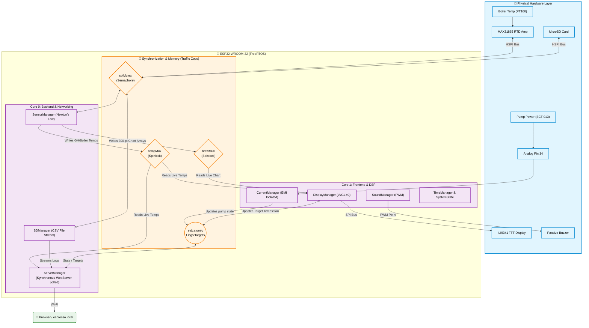

# ☕ Espresso Monitor (v1)

   

.png)

***coming soon: demo video (YouTube)***

## 🗂️ Table of Contents
- [What is it?](#-what-is-it)
- [What does it do?](#-what-does-it-do)
- [Why bother? (The Origin Story)](#-why-bother-the-origin-story)
- [What do we use? (BOM)](#-what-do-we-use-bom)
- [The Process, Rationalities, and Trouble Along the Way](#-the-process-rationalities-and-trouble-along-the-way)
- [Future Roadmap](#-future-roadmap)

---

## 💡 What is it?
This project's goal is to make every espresso lover's brewing much smarter with even the most "legacy" mechanical machines (specifically tested on my VBM Domobar Junior). It utilizes sensors and the full power and might of an ESP32-WROOM-32. We're talking a state-machine, dual-bus, and dual-core RTOS architecture with a high-FPS touch display.

## ⚙️ What does it do?
Using sensors, Wi-Fi, math, and some thermodynamics, we can:

* 🌡️ **Know exactly when the boiler is ready** using a high-precision PT100 temperature sensor, so we can steam milk already if we don't want the coffee and prefer just a hot chocolate (why?).
* 🔮 **Predict with surprising accuracy the machine's ready time** (after a per-machine calibration), so we know when the grouphead is actually ready to brew. 
* 🎵 **Audio Cues:** When ready, a melody plays via a passive buzzer, with 3 available options: the *Doom* theme, the *Helldivers 2* theme, or mute (for democracy).
* 📱 **Push Notifications:** Also when ready, an HTTP notification is sent via `ntfy.sh` to your phone, so you can work in another room and still know when your machine is ready to pull.
* 📈 **Live Telemetry:** Started brewing your shot? You get a live shot timer and boiler temps on a rolling 30-second chart! The brew is detected automatically with a non-invasive SCT current sensor clamped around the machine's pump wire.
* 🌐 **Interactive Web Dashboard:** A baked-in HTML/JS interface served locally (`espresso.local`). Watch live temps, view historical CSV logs and interactive charts, and see current machine status.
* ⭐ **Rate Your Shot:** A post-brew UI slider allows you to score the shot from 0-10, which is immediately appended to the SD card CSV log alongside the temperature data.

## 📖 Why bother? (The Origin Story)
The legendary E61 espresso grouphead is a marvel of 1960s thermodynamics. It uses a massive 4kg block of solid brass to guarantee temperature stability during a shot. But that massive thermal mass comes with a catch: while the internal boiler might reach 120°C in 3 minutes, the grouphead itself takes another 15+ minutes to absorb that heat and reach the perfect 90°C grouphead temperature for a 93°C-97°C brewing temperature. 

I wanted to know *exactly* when my machine was truly ready, track my shot parameters in real-time, and log the data to dial in my espresso. I also wanted to do it safely, without permanently modifying the machine or splicing into 220V mains power and risking a fiery death.

Thus, Espresso Monitor was born. 

## 🛠️ What do we use? (BOM)
* 🧠 **ESP32-WROOM-32:** The brains. Specifically, a DOIT DevKit V1 (though we use a custom partition scheme). For better quality of life- get one with a dev-board.
* 🌡️ **Adafruit MAX31865 RTD Amplifier & PT100 Probe:** For extreme temperature accuracy.
* ⚡ **SCT-013 Non-invasive AC Current Sensor:** To detect the water pump.
* 🔌 **10uF capacitor + two 10K ohms resistors:** Needed for the SCT to work (and not kill the ESP32).
* 🎧 **3.5mm female audio jack:** Instead of stripping the SCT's wire and soldering its tips to the circuit, it's much easier to just use a female jack (and just solder its back to the SCT circuit).
* 📺 **ILI9341 TFT SPI touch display 240x320:** The screen (I got a 2.8-inch).
* 💾 **MicroSD card module:** Any SD card you trust enough not to die tomorrow.
* 🔊 **Passive Buzzer:** For the audio cues.
* 🔀 **Wago splitters (Optional but recommended):** Less of a mess in your box and easy to use.
* 📏 **Extension wires for the PT100 (Optional):** Only use insulated cables! The PT100 is super sensitive. I used spare car backup camera wires.

### Architecture

---

## 🚧 The Process, Rationalities, and Trouble Along the Way

So... There I am, sitting there in front of an empty IDE project, and a desk full of electronic parts I ordered. Where do I start?

> 📝 *Side note: I originally started with a simple non-touch I2C 0.96-inch display and had no plans for a server yet. The tiny screen was cute, but it was holding me back. I wanted live rolling charts. I wanted touch controls. I wanted data. So, I upgraded to the 2.8" TFT and dove headfirst into the abyss of UI design and dual-core microcontrollers.*

Here is a chronological list of the walls I hit at 100mph, and how I engineered my way through them.

### 🔧 Phase 1: Physical Hardware & Electronics

#### 💥 1. You Can't Drill a Hole in a $1,500 Machine (Newton's Law)
I could measure the boiler, but how do you measure the temperature of a 4kg chrome brass E61 grouphead without physically putting a probe inside it? 

> **✅ The Fix:** Thermodynamics. I treated the boiler as the heat source and wrote a C++ algorithm using an inverted **Newton’s Law of Heating**. While the machine is in the `WARMUP` state, a stopwatch tracks the boiler and uses an exponential asymptote curve to estimate how much heat the brass has absorbed. Once it hits `READY`, the algorithm freezes the estimate to prevent the math from violently snapping the temperature backwards when internal timers reset. I even built a calibration screen. You stick a physical thermometer on your grouphead, enter that number into the UI spinbox, and the ESP32 dynamically reverse-engineers the thermal "sluggishness" ($\tau$) of your specific brass block. 

> 💡 **Pro-tip:** *If you rapidly click a "+" button 15 times to change a calibration setting, and your code writes that to NVS flash memory on every click, you will fry your flash chip's write-cycles in a month. I tied the NVS flash command to the RTOS state machine, so it only physically burns the new calibration to memory exactly once when you exit the Settings screen.*

> 📝 *Side note: If your machine is quite modern, and the boiler is right over the shower-head, it is probably ready to brew pretty much the moment the boiler is ready (but it's usually preferred to heat soak the portafilter too anyway).*

#### 💥 2. Faulty MAX31865 (Am I going insane? Maybe)
The cheap MAX31865 breakout board I grabbed off AliExpress seemed to be working great at first. I got a 3-wire PT100 sensor, soldered the pads "by the book," and called it a day. But as I started diving into FreeRTOS and splitting the sensor loops across two cores, boot stability went down the drain. The board began throwing persistent hardware faults, which actually turned out to be a massive blessing in disguise.

I noticed a bizarre anomaly: when the ESP32 suffered an early RTOS panic or a watchdog timeout and executed a warm software reboot, the MAX31865 would suddenly start outputting valid, live temperatures. If I cold-booted the system, it threw faults. If I hot-plugged the sensor or let the watchdog trigger a reset, it worked like magic. 

As any technician will tell you, magic doesn't exist in embedded electronics- only undocumented silicon states. 

During a cold boot, the chip executes a hard Power-On Reset (POR) fault-detection cycle. In a 3-wire configuration, the IC specifically requires Pin 5 (`FORCE+`) and Pin 6 (`FORCE2`) of its 20-pin TQFN package to be shorted together so it can cancel out lead wire resistance. After digging through the IC datasheet and tracing the board with a multimeter, I found the culprit: a microscopic manufacturing defect on the PCB trace. The solder jumper was closed, but Pin 6 was left completely floating in a high-impedance state. 

On a cold boot, the POR cycle immediately caught the floating pin and locked the chip down with a latching fault register. On a warm software reset, the MAX31865 never lost its 3.3V power rail; because the analog front-end was already energized and holding parasitic charges, the chip bypassed the POR checks and fell back into an uncompensated 2-wire reading mode. I got data, but the 3-wire resistance cancelation was entirely non-functional. Instead of wasting hours trying to micro-solder a bypass wire onto a microscopic TQFN pin, I chalked it up to clone hardware lottery and swapped the board.
> **✅ The Fix:** Buy a new one and hope it doesn't have that issue. Worked.

#### 💥 3. The RREF Reality Check (Resistance is Futile)
I had successfully switched the PT100 probe from a 2-wire to a 3-wire setup to get better accuracy, but the temperatures were still inexplicably drifting. I spent days wondering if the code was wrong, or if the chip had silently fallen back into 2-wire mode without telling me. 

> **✅ The Fix:** I finally took a multimeter to the physical MAX31865 breakout board. The reference resistor (RREF) soldered to the board is nominally supposed to be exactly 430.0 Ω for a PT100. Mine measured at 427.1 Ω. In the world of high-precision RTDs, a 3-ohm deviation at the hardware level completely skews the ADC math. I updated the C++ configuration to use the true measured resistance of my specific board, and the temperatures instantly locked in perfectly. Trust, but verify (with a multimeter).

#### 💥 4. The Screen Flicker (Audio vs. Video)
When I finally got the machine to play the *Doom* and *Helldivers* themes upon reaching the target temperature, I noticed the ILI9341 TFT display was visibly flickering in time with the music. My first thought was an SPI bus bottleneck struggling to push pixels while generating PWM audio or a voltage regulator / power supply issue.

> **✅ The Fix:** It wasn't a software bug; it was a power rail sag. I had wired the passive buzzer to the ESP32's 3.3V rail- the exact same rail powering the display's logic and backlight. Buzzers draw sudden, aggressive bursts of current. Every time a note played, it pulled the 3.3V rail down just enough to physically dim the screen. I moved the buzzer's power lead directly to the unregulated 5V `VIN` pin, completely isolating the heavy audio current from the delicate 3.3V logic rail. Flicker instantly solved.

---

### ⚡ Phase 2: Signal Processing & Electrical Gremlins

#### 💥 5. The 220V EMI Nightmare (Pump Detection)
I needed to start the shot timer the millisecond the 220V water pump turned on. Clamping an SCT-013 analog current sensor over the wire was safe, but the inside of an espresso machine is a nightmare of Electromagnetic Interference (EMI) from the heating elements. Also, clamping a wire as it is will probably still have so much EMI that you will never be able to distinguish a brew from idle.

> **✅ The Fix:** I built a dynamic `CurrentManager`. Instead of hardcoding a trigger value, the ESP32 samples the ambient electrical noise floor on boot, calculates the RMS voltage, sets a dynamic threshold, and applies a strict time-based debounce filter (ON for 250ms, OFF for 500ms) to guarantee the timer only triggers on true pump activation. *Crucially, I had to pin this DSP (Digital Signal Processing) loop specifically to Core 1. When it ran on Core 0, the ESP32's Wi-Fi radio would constantly interrupt the microsecond ADC sampling, creating "phantom" current readings. \
As for the clamping- I realized I need to "boost" the pump wire's signal. How? we loop the wire multiple times (I did like 8-10 loops) and clamp the SCT around it. The more loops you do, the more easy it is to detect a brew from phantom.*

> 💡 **Pro-tip (do at your own risk):** *Many machines (and most Italian machines) have very tightly stretched wires, so you won't be able to loop it. If that's your case, you should find a wire that can handle ~220v to non-invasively (using ferrules) lengthen the pump wire. I used an old PC power cable and stripped it, and inside are 3 thick 220v wires.*

#### 💥 6. Garbage In, Garbage Out (The "Galaxy" EMI)
During the phase where I was chasing down all the phantom EMI noise on the current clamp, I noticed the baseline system stability was just terrible. Wires were triggering false pump readings even when nobody was touching the machine.

> **✅ The Fix:** It turned out the "power supply" I was using for the ESP32 was an AliExpress "Samsung" phone charger I found in a drawer. It was injecting raw electrical noise straight into the ESP32's 5V rail, which propagated right into the ADC pins. Swapping to a clean, regulated power supply eliminated a massive chunk of the "ghosts" in the machine.

---

### 🧠 Phase 3: The RTOS & Architecture Ceiling

#### 💥 7. The 3.7-Second Death (Or: Never Trust the UI Builder)
I designed a beautiful interface using SquareLine Studio, exported the code, and flashed it. I pulled the virtual lever. 1 second... 2 seconds... 3.7 seconds... and the ESP32 violently panicked and rebooted. When it didn't crash, the chart drew wild, jagged lines of red "junk" data.

> **✅ The Fix:** SquareLine had hardcoded a tiny 10-point C-array into the background. When my code shoved 300 points of temperature data into that chart, it violently overwrote 290 adjacent memory addresses in RAM- corrupting FreeRTOS task pointers. I severed SquareLine's control over the chart entirely. By re-initializing the series natively in C++, LVGL's memory manager took over, allowing the chart to dynamically resize itself every tick safely without nuking the heap.

#### 💥 8. UI Thread Starvation (The Sluggish Ready Screen)
Once the system transitioned from `WARMUP` to `READY`, I noticed the timer and temperature texts were updating incredibly sluggishly. The touch responsiveness felt like it was swimming in molasses. 

> **✅ The Fix:** This was a UI thread-starvation issue. I was forcing LVGL to aggressively redraw heavy graphical elements and re-evaluate strings on every single frame tick, choking Core 1. I added state-tracking variables so the screen only commands an LVGL label update when the actual underlying integer (like the `seconds` value) physically changes. The UI instantly returned to a buttery smooth framerate. 

#### 💥 9. The Missing Espresso (The Beat Frequency Bug)
I ran a mock 25-second shot. When I looked at the summary chart, it only showed about 18 seconds of data. Two-thirds of the graph was just... gone. Where did my espresso go?

> **✅ The Fix:** A classic RTOS timing collision. My main loop had a `delay(33)` to feed the FreeRTOS watchdog. I was also saving a data point every `100ms` via `millis()`. But 33 + 33 + 33 = 99. The 3rd loop was *just barely* too fast, so the ESP32 waited for the 4th loop (132ms) to log the data. I thought I was logging perfectly, but I was secretly dropping frames. I abandoned `millis()` entirely and synced the array writes directly to the visual seconds timer string changing on the UI. Flawless, perfectly synced 1Hz logging. This also reduces unnecessary load on the ESP32 when there's no real new data to output.

#### 💥 10. The 1.79MB Brick Wall
I wanted an Async web server so I didn't have to squint at the machine from the living room. I crammed an HTML dashboard into the code, hit compile and... `Compilation error: text section exceeds available space.` My binary was 1.79MB. The default ESP32 partition scheme only gives you 1.2MB for the app.

> **✅ The Fix:** A good engineer knows when to kill his darlings. I switched to the `Huge APP (3MB No OTA)` partition scheme. Goodbye Over-The-Air Wi-Fi updates. Goodbye to the mini-game I wanted to add. I sacrificed them to the memory gods, unlocking 3MB of pure, unadulterated headroom. \
I wasn't using OTA anyway, since the USB is (even now) very easily accessible whenever I want to update the firmware. As for the game? novelty. Might add at some later point, but v2 is more important to me (see plan below).

#### 💥 11. The Shared SPI Bus of Death
The SD Card? Works perfectly. The PT100 temperature amplifier? Works perfectly. Both of them running at the same time? Absolute chaos. They share the exact same HSPI hardware pins. Because Core 0 (the web server) and Core 1 (the UI) were running asynchronously, if they both tried to use the pins at the same microsecond, the machine locked up.

> **✅ The Fix:** Time to put those talks about Mutexes from the OS course in Uni into practice. I implemented a strict FreeRTOS `SemaphoreHandle_t` (the `spiMutex`). Every SD card write and temperature read is wrapped in a mutex lock. The cores have to politely wait their turn to talk over the physical copper wires. Zero collisions.

#### 💥 12. The Phantom WiFi Crash (And the Magic of `addr2line`)
As the web dashboard got more complex, the ESP32 started hanging randomly when I tried to load the page. It looked exactly like a classic lwIP/WiFi stack crash. I spent multiple frustrating sessions throwing network-level bandaids at it: forcing `Connection: close` headers, adding `client.stop()` calls, tweaking socket timeouts. Absolutely nothing worked.

> **✅ The Fix:** I finally stopped guessing and pulled the raw Core Panic backtrace logs from the serial monitor. I took the raw hexadecimal memory addresses from the crash and translated the hex addresses back into my C++ code, and the results blew my mind: the crash had absolutely *nothing* to do with the web server. The addresses pointed directly into the `FatFS` / VFS (Virtual File System) libraries. The SD card was occasionally doing a massive, blocking SPI busy-wait to wear-level its flash memory. Because the SD card and WiFi stack share RTOS resources, the blocking file-system was starving the web server of execution time, making the WiFi *look* dead. 
> **The Lesson:** Never guess. Decode the backtrace first, theorize second.

#### 💥 13. The Ticking "RAM Bomb"
I added a button to the dashboard to download the CSV log. I used `file.readString()` to load the file from the SD card into a string to send over Wi-Fi. It worked great... for about 150 shots. By my ~180th shot, that file would be larger than the ESP32's fragile heap memory, triggering an Out-Of-Memory panic.

> **✅ The Fix:** I bypassed the RAM entirely, switching to the `streamFile` method to chunk the CSV data bit-by-bit directly to the Wi-Fi chip. Oh, and I added a CLEAR LOGS button in settings in bright red, because the absolute last thing I ever want to do is unscrew this enclosure to pop out the SD card.

---

## 📺 What You See

### Warmup screen (boiler heating up first)

.png)

### Warmup screen (grouphead started heating up)

.png)

### Warmup screen (grouphead almost at temp)

.png)

### Ready screen

.png)

### Settings screen

.png)

### Brew screen

.png)

### Done screen

.png)

### server page

.png) 

---

## 🎁 Bonus *Good to Know* Features

* Server charts are interactive: press any spot on the chart for an accurate data at that specific point.
* Choose a melody you want to play when the machine is ready: default is mute. But you can choose *Helldivers* or *Doom*.
* Rate your shot when the brew is done; this feature will be utilized further in the future using an LLM API.
* *Helldivers* themed UI (a Helldiver holding a cup in Done screen, a coffee beans field in a *Helldivers* world, etc.).
* *Much more...* 🫘
* *Even more in the future!* ☕️

---

## 🚀 Future Roadmap
* Adding AI (API) based log analysis and recommendations.
* Adding a Bluetooth scale to stop the brewing automatically at a desired shot weight (using a relay).
* ~~Adding a mini-game to play on the touch screen while waiting for the heat soak.~~ *(Killed to protect RTOS stability. A good engineer knows when to say no).*

***

> ☕ *Built with C++, FreeRTOS, and far too much caffeine.* \
> *DISCLAIMER: AI was used to polish the photos (reflections and dirt), general consult and some code generation and refactoring.*